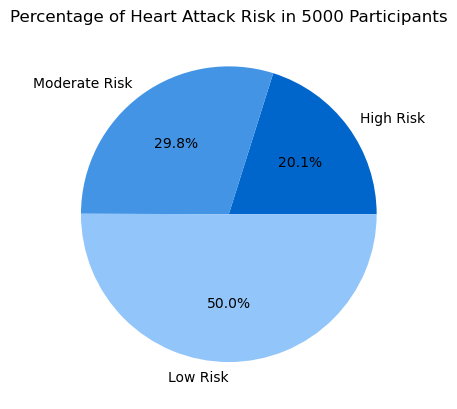
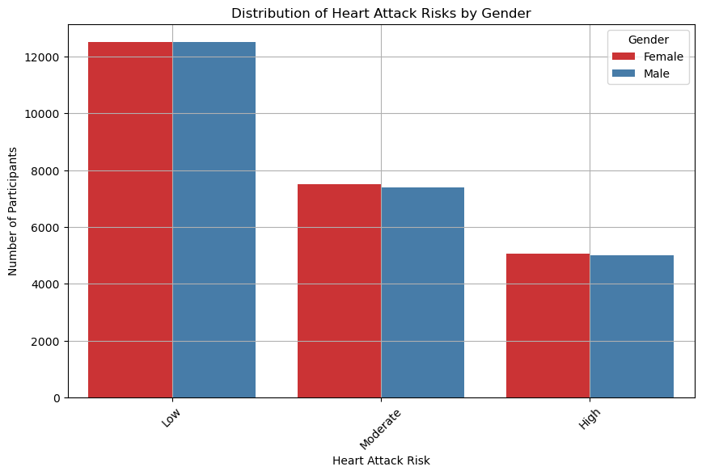
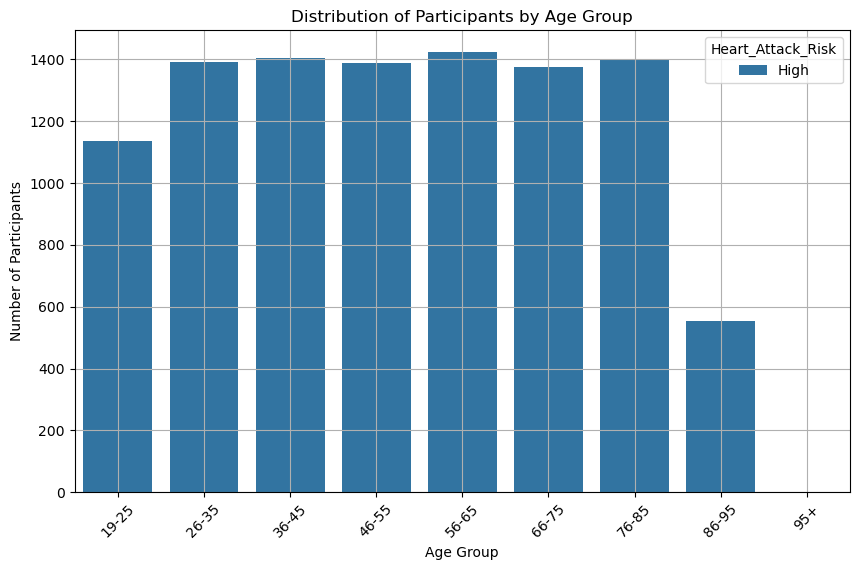
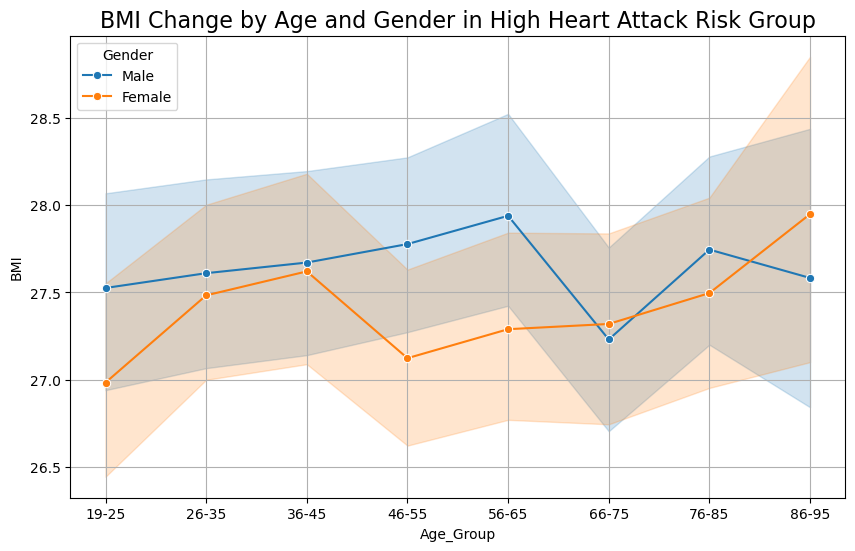

# Assignment 3

For BABI 4005 DQM with Python

By: ITMG 4J Sijian Liang (Cindy)

_Updated 2025-01-26_


```python
## Import any libraries/modules/packages 

## pandas is the dplyr of python, it lets us deal with data frames
import pandas 
import numpy as np

## graphic packages
import matplotlib.pyplot as plt
import seaborn as sns

## and make sure our plots look good
%matplotlib inline
```


```python
## Look at the data from the Kaggle: Heart Attack Risk dataset: https://www.kaggle.com/datasets/arifmia/heart-attack-risk-dataset
Heart_risk = pandas.read_csv("heart_attack_risk_dataset.csv") 
```

# Introduction

## Heart Attack Risk Prediction Dataset

__Dataset Overview__

The Heart Attack Risk Prediction Dataset is a dataset from Kaggle (https://www.kaggle.com/datasets/arifmia/heart-attack-risk-dataset). 

- It contains 50,000 rows and 20 columns, capturing various attributes that may have effects on heart attack.

- It is a clean dataset without any null values. The key variable is Heart_Attack_Risk (Low, Moderate, High).

- It contains 2 "float64" columns, 7 "object" columns, and 11 "int64" columns. However, 7 out of 11 "int64" columns should be boolean columns. To analyze more conveniently, I converted 7 "int64" columns to "boolean" columns. 

Details are as below.

__Graphs of Dataset and Data Analysis__

Following the "Data Summary" section, five analyses were conducted to provide insights into the dataset. While heart attack risk may be influenced by various factors, these analyses focus on basic observations and patterns, without delving into causal relationships between specific elements and heart attack risks.

# Data Summary

## 1. Total Rows and Columns
50000 rows and 20 columns


```python
Heart_risk.shape
print("There are",Heart_risk.shape[0],"rows and",Heart_risk.shape[1],"columns")
```

    There are 50000 rows and 20 columns
    

## 2. Summary Statistics


```python
Heart_risk.describe(include = "all").round(2) #summaries all statistics
```


<div>
<style scoped>
    .dataframe tbody tr th:only-of-type {
        vertical-align: middle;
    }

    .dataframe tbody tr th {
        vertical-align: top;
    }

    .dataframe thead th {
        text-align: right;
    }
</style>
<table border="1" class="dataframe">
  <thead>
    <tr style="text-align: right;">
      <th></th>
      <th>Age</th>
      <th>Gender</th>
      <th>Smoking</th>
      <th>Alcohol_Consumption</th>
      <th>Physical_Activity_Level</th>
      <th>BMI</th>
      <th>Diabetes</th>
      <th>Hypertension</th>
      <th>Cholesterol_Level</th>
      <th>Resting_BP</th>
      <th>Heart_Rate</th>
      <th>Family_History</th>
      <th>Stress_Level</th>
      <th>Chest_Pain_Type</th>
      <th>Thalassemia</th>
      <th>Fasting_Blood_Sugar</th>
      <th>ECG_Results</th>
      <th>Exercise_Induced_Angina</th>
      <th>Max_Heart_Rate_Achieved</th>
      <th>Heart_Attack_Risk</th>
    </tr>
  </thead>
  <tbody>
    <tr>
      <th>count</th>
      <td>50000.0</td>
      <td>50000</td>
      <td>50000.00</td>
      <td>50000.00</td>
      <td>50000</td>
      <td>50000.00</td>
      <td>50000.0</td>
      <td>50000.00</td>
      <td>50000.00</td>
      <td>50000.00</td>
      <td>50000.00</td>
      <td>50000.00</td>
      <td>50000</td>
      <td>50000</td>
      <td>50000</td>
      <td>50000.00</td>
      <td>50000</td>
      <td>50000.0</td>
      <td>50000.00</td>
      <td>50000</td>
    </tr>
    <tr>
      <th>unique</th>
      <td>NaN</td>
      <td>2</td>
      <td>NaN</td>
      <td>NaN</td>
      <td>3</td>
      <td>NaN</td>
      <td>NaN</td>
      <td>NaN</td>
      <td>NaN</td>
      <td>NaN</td>
      <td>NaN</td>
      <td>NaN</td>
      <td>3</td>
      <td>4</td>
      <td>3</td>
      <td>NaN</td>
      <td>3</td>
      <td>NaN</td>
      <td>NaN</td>
      <td>3</td>
    </tr>
    <tr>
      <th>top</th>
      <td>NaN</td>
      <td>Female</td>
      <td>NaN</td>
      <td>NaN</td>
      <td>Low</td>
      <td>NaN</td>
      <td>NaN</td>
      <td>NaN</td>
      <td>NaN</td>
      <td>NaN</td>
      <td>NaN</td>
      <td>NaN</td>
      <td>Moderate</td>
      <td>Typical</td>
      <td>Normal</td>
      <td>NaN</td>
      <td>Normal</td>
      <td>NaN</td>
      <td>NaN</td>
      <td>Low</td>
    </tr>
    <tr>
      <th>freq</th>
      <td>NaN</td>
      <td>25086</td>
      <td>NaN</td>
      <td>NaN</td>
      <td>20061</td>
      <td>NaN</td>
      <td>NaN</td>
      <td>NaN</td>
      <td>NaN</td>
      <td>NaN</td>
      <td>NaN</td>
      <td>NaN</td>
      <td>24971</td>
      <td>12642</td>
      <td>16797</td>
      <td>NaN</td>
      <td>16799</td>
      <td>NaN</td>
      <td>NaN</td>
      <td>25024</td>
    </tr>
    <tr>
      <th>mean</th>
      <td>53.4</td>
      <td>NaN</td>
      <td>0.30</td>
      <td>0.40</td>
      <td>NaN</td>
      <td>27.52</td>
      <td>0.2</td>
      <td>0.30</td>
      <td>225.04</td>
      <td>134.43</td>
      <td>94.53</td>
      <td>0.30</td>
      <td>NaN</td>
      <td>NaN</td>
      <td>NaN</td>
      <td>0.15</td>
      <td>NaN</td>
      <td>0.2</td>
      <td>149.31</td>
      <td>NaN</td>
    </tr>
    <tr>
      <th>std</th>
      <td>20.8</td>
      <td>NaN</td>
      <td>0.46</td>
      <td>0.49</td>
      <td>NaN</td>
      <td>7.23</td>
      <td>0.4</td>
      <td>0.46</td>
      <td>43.32</td>
      <td>25.91</td>
      <td>20.19</td>
      <td>0.46</td>
      <td>NaN</td>
      <td>NaN</td>
      <td>NaN</td>
      <td>0.36</td>
      <td>NaN</td>
      <td>0.4</td>
      <td>28.82</td>
      <td>NaN</td>
    </tr>
    <tr>
      <th>min</th>
      <td>18.0</td>
      <td>NaN</td>
      <td>0.00</td>
      <td>0.00</td>
      <td>NaN</td>
      <td>15.00</td>
      <td>0.0</td>
      <td>0.00</td>
      <td>150.00</td>
      <td>90.00</td>
      <td>60.00</td>
      <td>0.00</td>
      <td>NaN</td>
      <td>NaN</td>
      <td>NaN</td>
      <td>0.00</td>
      <td>NaN</td>
      <td>0.0</td>
      <td>100.00</td>
      <td>NaN</td>
    </tr>
    <tr>
      <th>25%</th>
      <td>35.0</td>
      <td>NaN</td>
      <td>0.00</td>
      <td>0.00</td>
      <td>NaN</td>
      <td>21.27</td>
      <td>0.0</td>
      <td>0.00</td>
      <td>187.30</td>
      <td>112.00</td>
      <td>77.00</td>
      <td>0.00</td>
      <td>NaN</td>
      <td>NaN</td>
      <td>NaN</td>
      <td>0.00</td>
      <td>NaN</td>
      <td>0.0</td>
      <td>124.00</td>
      <td>NaN</td>
    </tr>
    <tr>
      <th>50%</th>
      <td>53.0</td>
      <td>NaN</td>
      <td>0.00</td>
      <td>0.00</td>
      <td>NaN</td>
      <td>27.54</td>
      <td>0.0</td>
      <td>0.00</td>
      <td>225.10</td>
      <td>134.00</td>
      <td>94.00</td>
      <td>0.00</td>
      <td>NaN</td>
      <td>NaN</td>
      <td>NaN</td>
      <td>0.00</td>
      <td>NaN</td>
      <td>0.0</td>
      <td>149.00</td>
      <td>NaN</td>
    </tr>
    <tr>
      <th>75%</th>
      <td>71.0</td>
      <td>NaN</td>
      <td>1.00</td>
      <td>1.00</td>
      <td>NaN</td>
      <td>33.77</td>
      <td>0.0</td>
      <td>1.00</td>
      <td>262.60</td>
      <td>157.00</td>
      <td>112.00</td>
      <td>1.00</td>
      <td>NaN</td>
      <td>NaN</td>
      <td>NaN</td>
      <td>0.00</td>
      <td>NaN</td>
      <td>0.0</td>
      <td>174.00</td>
      <td>NaN</td>
    </tr>
    <tr>
      <th>max</th>
      <td>89.0</td>
      <td>NaN</td>
      <td>1.00</td>
      <td>1.00</td>
      <td>NaN</td>
      <td>40.00</td>
      <td>1.0</td>
      <td>1.00</td>
      <td>300.00</td>
      <td>179.00</td>
      <td>129.00</td>
      <td>1.00</td>
      <td>NaN</td>
      <td>NaN</td>
      <td>NaN</td>
      <td>1.00</td>
      <td>NaN</td>
      <td>1.0</td>
      <td>199.00</td>
      <td>NaN</td>
    </tr>
  </tbody>
</table>
</div>


## 3. NA values in each column

All columns have value. It is a non-null dataset.


```python
## NA values in each column
print(Heart_risk.isna().sum()) # isna - find how many na values; sum() is summary function

```

    Age                        0
    Gender                     0
    Smoking                    0
    Alcohol_Consumption        0
    Physical_Activity_Level    0
    BMI                        0
    Diabetes                   0
    Hypertension               0
    Cholesterol_Level          0
    Resting_BP                 0
    Heart_Rate                 0
    Family_History             0
    Stress_Level               0
    Chest_Pain_Type            0
    Thalassemia                0
    Fasting_Blood_Sugar        0
    ECG_Results                0
    Exercise_Induced_Angina    0
    Max_Heart_Rate_Achieved    0
    Heart_Attack_Risk          0
    dtype: int64
    

## 4. Summary of Data Types

It contains 2 "float64" columns, 7 "object" columns, and 11 "int64" columns. However, 7 out of 11 "int64" columns should be boolean variables. 


```python
# count the number of each data type
data_type_counts = Heart_risk.dtypes.value_counts()
print(data_type_counts)

# data type detail list
Heart_risk.dtypes

```

    int64      11
    object      7
    float64     2
    Name: count, dtype: int64
    


    Age                          int64
    Gender                      object
    Smoking                      int64
    Alcohol_Consumption          int64
    Physical_Activity_Level     object
    BMI                        float64
    Diabetes                     int64
    Hypertension                 int64
    Cholesterol_Level          float64
    Resting_BP                   int64
    Heart_Rate                   int64
    Family_History               int64
    Stress_Level                object
    Chest_Pain_Type             object
    Thalassemia                 object
    Fasting_Blood_Sugar          int64
    ECG_Results                 object
    Exercise_Induced_Angina      int64
    Max_Heart_Rate_Achieved      int64
    Heart_Attack_Risk           object
    dtype: object


### Convert 7 int64 Columns to Boolean Variables


```python
# Convert 7 int64 columns to boolean variables
# Including Smoking, Alcohol_Consumption, Diabetes, Hypertension, Hypertension, Family_History, Fasting_Blood_Sugar, Exercise_Induced_Angina

Heart_risk['Smoking'] = Heart_risk['Smoking'].apply(lambda x: True if x == 1 else False)
Heart_risk['Alcohol_Consumption'] = Heart_risk['Alcohol_Consumption'].apply(lambda x: True if x == 1 else False)
Heart_risk['Diabetes'] = Heart_risk['Diabetes'].apply(lambda x: True if x == 1 else False)
Heart_risk['Hypertension'] = Heart_risk['Hypertension'].apply(lambda x: True if x == 1 else False)
Heart_risk['Family_History'] = Heart_risk['Family_History'].apply(lambda x: True if x == 1 else False)
Heart_risk['Fasting_Blood_Sugar'] = Heart_risk['Fasting_Blood_Sugar'].apply(lambda x: True if x == 1 else False)
Heart_risk['Exercise_Induced_Angina'] = Heart_risk['Exercise_Induced_Angina'].apply(lambda x: True if x == 1 else False)

Heart_risk.head(15)

```


<div>
<style scoped>
    .dataframe tbody tr th:only-of-type {
        vertical-align: middle;
    }

    .dataframe tbody tr th {
        vertical-align: top;
    }

    .dataframe thead th {
        text-align: right;
    }
</style>
<table border="1" class="dataframe">
  <thead>
    <tr style="text-align: right;">
      <th></th>
      <th>Age</th>
      <th>Gender</th>
      <th>Smoking</th>
      <th>Alcohol_Consumption</th>
      <th>Physical_Activity_Level</th>
      <th>BMI</th>
      <th>Diabetes</th>
      <th>Hypertension</th>
      <th>Cholesterol_Level</th>
      <th>Resting_BP</th>
      <th>Heart_Rate</th>
      <th>Family_History</th>
      <th>Stress_Level</th>
      <th>Chest_Pain_Type</th>
      <th>Thalassemia</th>
      <th>Fasting_Blood_Sugar</th>
      <th>ECG_Results</th>
      <th>Exercise_Induced_Angina</th>
      <th>Max_Heart_Rate_Achieved</th>
      <th>Heart_Attack_Risk</th>
    </tr>
  </thead>
  <tbody>
    <tr>
      <th>0</th>
      <td>69</td>
      <td>Female</td>
      <td>True</td>
      <td>False</td>
      <td>Moderate</td>
      <td>34.61</td>
      <td>True</td>
      <td>False</td>
      <td>152.1</td>
      <td>171</td>
      <td>85</td>
      <td>False</td>
      <td>Moderate</td>
      <td>Non-anginal</td>
      <td>Reversible defect</td>
      <td>False</td>
      <td>Normal</td>
      <td>False</td>
      <td>114</td>
      <td>Low</td>
    </tr>
    <tr>
      <th>1</th>
      <td>32</td>
      <td>Male</td>
      <td>False</td>
      <td>False</td>
      <td>Moderate</td>
      <td>22.75</td>
      <td>False</td>
      <td>False</td>
      <td>166.8</td>
      <td>126</td>
      <td>103</td>
      <td>False</td>
      <td>Low</td>
      <td>Asymptomatic</td>
      <td>Normal</td>
      <td>False</td>
      <td>ST-T abnormality</td>
      <td>False</td>
      <td>173</td>
      <td>Moderate</td>
    </tr>
    <tr>
      <th>2</th>
      <td>89</td>
      <td>Male</td>
      <td>False</td>
      <td>True</td>
      <td>Moderate</td>
      <td>35.32</td>
      <td>False</td>
      <td>False</td>
      <td>272.3</td>
      <td>123</td>
      <td>127</td>
      <td>False</td>
      <td>Low</td>
      <td>Typical</td>
      <td>Reversible defect</td>
      <td>False</td>
      <td>ST-T abnormality</td>
      <td>False</td>
      <td>109</td>
      <td>Low</td>
    </tr>
    <tr>
      <th>3</th>
      <td>78</td>
      <td>Male</td>
      <td>False</td>
      <td>True</td>
      <td>Moderate</td>
      <td>18.23</td>
      <td>True</td>
      <td>False</td>
      <td>237.7</td>
      <td>144</td>
      <td>125</td>
      <td>False</td>
      <td>Low</td>
      <td>Typical</td>
      <td>Fixed defect</td>
      <td>True</td>
      <td>Left Ventricular Hypertrophy</td>
      <td>False</td>
      <td>129</td>
      <td>Low</td>
    </tr>
    <tr>
      <th>4</th>
      <td>38</td>
      <td>Female</td>
      <td>True</td>
      <td>False</td>
      <td>Moderate</td>
      <td>19.82</td>
      <td>False</td>
      <td>False</td>
      <td>207.7</td>
      <td>123</td>
      <td>107</td>
      <td>False</td>
      <td>High</td>
      <td>Asymptomatic</td>
      <td>Reversible defect</td>
      <td>False</td>
      <td>ST-T abnormality</td>
      <td>False</td>
      <td>124</td>
      <td>Moderate</td>
    </tr>
    <tr>
      <th>5</th>
      <td>41</td>
      <td>Male</td>
      <td>False</td>
      <td>True</td>
      <td>Moderate</td>
      <td>36.11</td>
      <td>False</td>
      <td>False</td>
      <td>271.2</td>
      <td>141</td>
      <td>119</td>
      <td>False</td>
      <td>Low</td>
      <td>Atypical</td>
      <td>Fixed defect</td>
      <td>False</td>
      <td>Normal</td>
      <td>False</td>
      <td>101</td>
      <td>High</td>
    </tr>
    <tr>
      <th>6</th>
      <td>20</td>
      <td>Male</td>
      <td>True</td>
      <td>False</td>
      <td>Low</td>
      <td>15.12</td>
      <td>False</td>
      <td>False</td>
      <td>164.8</td>
      <td>154</td>
      <td>67</td>
      <td>False</td>
      <td>Low</td>
      <td>Non-anginal</td>
      <td>Normal</td>
      <td>False</td>
      <td>Normal</td>
      <td>False</td>
      <td>176</td>
      <td>Low</td>
    </tr>
    <tr>
      <th>7</th>
      <td>39</td>
      <td>Female</td>
      <td>False</td>
      <td>False</td>
      <td>Moderate</td>
      <td>20.78</td>
      <td>False</td>
      <td>False</td>
      <td>297.0</td>
      <td>91</td>
      <td>112</td>
      <td>False</td>
      <td>Low</td>
      <td>Atypical</td>
      <td>Normal</td>
      <td>False</td>
      <td>ST-T abnormality</td>
      <td>True</td>
      <td>134</td>
      <td>Moderate</td>
    </tr>
    <tr>
      <th>8</th>
      <td>70</td>
      <td>Male</td>
      <td>False</td>
      <td>True</td>
      <td>High</td>
      <td>29.20</td>
      <td>False</td>
      <td>False</td>
      <td>280.7</td>
      <td>121</td>
      <td>71</td>
      <td>False</td>
      <td>Moderate</td>
      <td>Non-anginal</td>
      <td>Fixed defect</td>
      <td>False</td>
      <td>ST-T abnormality</td>
      <td>False</td>
      <td>168</td>
      <td>Moderate</td>
    </tr>
    <tr>
      <th>9</th>
      <td>19</td>
      <td>Female</td>
      <td>False</td>
      <td>False</td>
      <td>High</td>
      <td>35.54</td>
      <td>False</td>
      <td>True</td>
      <td>275.0</td>
      <td>167</td>
      <td>76</td>
      <td>False</td>
      <td>Low</td>
      <td>Typical</td>
      <td>Reversible defect</td>
      <td>True</td>
      <td>Left Ventricular Hypertrophy</td>
      <td>False</td>
      <td>102</td>
      <td>Moderate</td>
    </tr>
    <tr>
      <th>10</th>
      <td>47</td>
      <td>Male</td>
      <td>True</td>
      <td>False</td>
      <td>Moderate</td>
      <td>29.86</td>
      <td>False</td>
      <td>True</td>
      <td>225.7</td>
      <td>110</td>
      <td>71</td>
      <td>False</td>
      <td>Moderate</td>
      <td>Non-anginal</td>
      <td>Reversible defect</td>
      <td>True</td>
      <td>Normal</td>
      <td>False</td>
      <td>146</td>
      <td>Low</td>
    </tr>
    <tr>
      <th>11</th>
      <td>55</td>
      <td>Female</td>
      <td>False</td>
      <td>False</td>
      <td>Moderate</td>
      <td>31.32</td>
      <td>False</td>
      <td>False</td>
      <td>280.2</td>
      <td>113</td>
      <td>105</td>
      <td>False</td>
      <td>Low</td>
      <td>Asymptomatic</td>
      <td>Normal</td>
      <td>False</td>
      <td>Left Ventricular Hypertrophy</td>
      <td>True</td>
      <td>124</td>
      <td>High</td>
    </tr>
    <tr>
      <th>12</th>
      <td>19</td>
      <td>Female</td>
      <td>False</td>
      <td>False</td>
      <td>High</td>
      <td>22.59</td>
      <td>False</td>
      <td>False</td>
      <td>215.5</td>
      <td>109</td>
      <td>87</td>
      <td>False</td>
      <td>Low</td>
      <td>Asymptomatic</td>
      <td>Fixed defect</td>
      <td>False</td>
      <td>Left Ventricular Hypertrophy</td>
      <td>False</td>
      <td>110</td>
      <td>Moderate</td>
    </tr>
    <tr>
      <th>13</th>
      <td>81</td>
      <td>Female</td>
      <td>False</td>
      <td>True</td>
      <td>Low</td>
      <td>37.90</td>
      <td>False</td>
      <td>False</td>
      <td>196.9</td>
      <td>176</td>
      <td>129</td>
      <td>False</td>
      <td>Low</td>
      <td>Non-anginal</td>
      <td>Fixed defect</td>
      <td>False</td>
      <td>Normal</td>
      <td>True</td>
      <td>135</td>
      <td>Moderate</td>
    </tr>
    <tr>
      <th>14</th>
      <td>77</td>
      <td>Male</td>
      <td>False</td>
      <td>False</td>
      <td>High</td>
      <td>20.18</td>
      <td>False</td>
      <td>True</td>
      <td>298.5</td>
      <td>178</td>
      <td>94</td>
      <td>False</td>
      <td>Low</td>
      <td>Asymptomatic</td>
      <td>Fixed defect</td>
      <td>False</td>
      <td>ST-T abnormality</td>
      <td>False</td>
      <td>159</td>
      <td>Low</td>
    </tr>
  </tbody>
</table>
</div>


```python
# Update data type detail list
Heart_risk.dtypes
```


    Age                          int64
    Gender                      object
    Smoking                       bool
    Alcohol_Consumption           bool
    Physical_Activity_Level     object
    BMI                        float64
    Diabetes                      bool
    Hypertension                  bool
    Cholesterol_Level          float64
    Resting_BP                   int64
    Heart_Rate                   int64
    Family_History                bool
    Stress_Level                object
    Chest_Pain_Type             object
    Thalassemia                 object
    Fasting_Blood_Sugar           bool
    ECG_Results                 object
    Exercise_Induced_Angina       bool
    Max_Heart_Rate_Achieved      int64
    Heart_Attack_Risk           object
    dtype: object


# Graphs of Dataset and Data Analysis

The following analysis examines participants at high risk for heart attacks, focusing on their gender, age, and BMI, while providing key health metrics as reference data for this high-risk group. The analysis is divided into the following sections:

1. __Percentage of Participants in Heart Attack Risk__

    A breakdown of the prevalence of heart attack risk among 5,000 participants.
   
2. __Gender Distribution of Heart Attack Risks__

    Analyzing how heart attack risk varies between males and females.

3. __Age Group Analysis of High Heart Attack Risk__

    Insights into the age groups most affected by high heart attack risk.

4. __BMI Trends by Age and Gender__

    Visualization of how BMI changes with age across genders in the high heart attack risk group.

5. __Health Metric Summary for High-Risk Participants__

    A table summarizing key health measures such as cholesterol levels, resting blood pressure, and heart rate for participants at high risk.

## 1. Percentage of Participants in Heart Attack Risk

The pie chart shows the percentage of different heart attack risks among 5,000 participants. 

20.1% of participants are considered to have high heart attack risk. 

29.8% of them are moderate risk and 50% of them are low risk.


```python

# Learned from: 
## W3schools Pie Charts: https://www.w3schools.com/python/matplotlib_pie_charts.asp 
## Matplotlib: https://matplotlib.org/stable/gallery/pie_and_polar_charts/pie_features.html
## Color family: https://www.patternfly.org/charts/colors-for-charts/

# Define three kinds of heart attack risk  
High = Heart_risk.query("Heart_Attack_Risk == 'High'").shape[0]
Moderate = Heart_risk.query("Heart_Attack_Risk == 'Moderate'").shape[0]
Low = Heart_risk.query("Heart_Attack_Risk == 'Low'").shape[0]

#Create a pie chart by risk
y = np.array([High, Moderate, Low])
Status = ["High Risk", "Moderate Risk", "Low Risk"]
mycolors = ["#0066CC", "#4394E5","#92C5F9"]

plt.title("Percentage of Heart Attack Risk in 5000 Participants")
plt.pie(y, labels = Status, colors = mycolors, autopct='%1.1f%%')

plt.show() 
```


    

    


## 2. Distribution of Heart Attack Risks by Gender

In a total of 5000 data samples, the number of high heart attack risks in females is slightly more than in males.


```python
# Create a count plot
plt.figure(figsize=(10, 6))

sns.countplot(x="Heart_Attack_Risk", hue="Gender", data=Heart_risk, palette= "Set1")

plt.title("Distribution of Heart Attack Risks by Gender")
plt.xlabel("Heart Attack Risk")
plt.ylabel("Number of Participants")
plt.legend(title="Gender")
plt.grid(True)
plt.xticks(rotation=45)
plt.show()
```


    

    


## 3. Age Group Analysis of High Heart Attack Risk

The bar chart shows that the majority of participants who are considered to be at “high risk of heart disease” are aged 56-65. With following is the 36-45 age group.


```python
# Learned from: Stackoverflow: https://stackoverflow.com/questions/73655852/how-to-bin-age-data-into-categories-issues-with-setting-highs-and-lows

Heart_risk_1 = Heart_risk.query("Heart_Attack_Risk == 'High'")
Heart_risk_high = pandas.DataFrame(Heart_risk_1)

# Bin age group of customer
binned = pandas.cut(
    Heart_risk_high["Age"],
    bins=[-np.inf, 25, 35, 45, 55, 65, 75, 85, 95, np.inf],
    labels=["19-25", "26-35", "36-45", "46-55", "56-65", "66-75", "76-85", "86-95", "95+"],
)

# Add the binned column to the DataFrame
Heart_risk_high["Age_Group"] = binned

# Create a count plot
plt.figure(figsize=(10, 6))

sns.countplot(x="Age_Group", hue="Heart_Attack_Risk", data=Heart_risk_high, palette= "tab10")

plt.title("Distribution of Participants by Age Group")
plt.xlabel("Age Group")
plt.ylabel("Number of Participants")
plt.legend(title="Heart_Attack_Risk")
plt.grid(True)
plt.xticks(rotation=45)
plt.show()
```


    

    


## 4. BMI Change by Age and Gender in High Heart Attack Risk Group

Based on the age group and gender, the line chart shows the average BMI changes in the high heart attack risk group. In the age group "56-65", male has the highest BMI and females' BMI tends to increase.


```python
# Plot a line chart for BMI
plt.figure(figsize=(10, 6))
sns.lineplot(data=Heart_risk_high, x='Age_Group', y='BMI', hue='Gender', marker='o') #sns.lineplot() automatically calculates the mean 
plt.title('BMI Change by Age and Gender in High Heart Attack Risk Group', fontsize=16) 
plt.xlabel('Age_Group')
plt.ylabel('BMI')
plt.legend(title='Gender')
plt.grid(True)
plt.show()

# Learn from: 
# https://seaborn.pydata.org/generated/seaborn.lineplot.html; 
# https://www.geeksforgeeks.org/seaborn-lineplot-method-in-python/; 
# https://learn.saylor.org/mod/book/view.php?id=55306&chapterid=40878
```


    

    


## 5. Health Metric Summary for High-Risk Participants

Focused on the age 56-66 samples, some health metrics for high heart attack risk participants were summarized, including BMI, Cholesterol Level, Heart Rate and Resting blood pressure (BP) by gender. 


```python
Heart_risk_high2 = Heart_risk.query("Heart_Attack_Risk == 'High' & Age > 56 & Age < 66 ")
Heart_risk_2 = pandas.DataFrame(Heart_risk_high2)

pivot_Heart_risk_2 = pandas.pivot_table(Heart_risk_2, index=["Age", "Gender"], 
                                values=["BMI", "Cholesterol_Level", "Resting_BP", "Heart_Rate"],
                                aggfunc='mean')

pivot_Heart_risk_2.round(2)

```


<div>
<style scoped>
    .dataframe tbody tr th:only-of-type {
        vertical-align: middle;
    }

    .dataframe tbody tr th {
        vertical-align: top;
    }

    .dataframe thead th {
        text-align: right;
    }
</style>
<table border="1" class="dataframe">
  <thead>
    <tr style="text-align: right;">
      <th></th>
      <th></th>
      <th>BMI</th>
      <th>Cholesterol_Level</th>
      <th>Heart_Rate</th>
      <th>Resting_BP</th>
    </tr>
    <tr>
      <th>Age</th>
      <th>Gender</th>
      <th></th>
      <th></th>
      <th></th>
      <th></th>
    </tr>
  </thead>
  <tbody>
    <tr>
      <th rowspan="2" valign="top">57</th>
      <th>Female</th>
      <td>28.45</td>
      <td>226.50</td>
      <td>95.96</td>
      <td>128.92</td>
    </tr>
    <tr>
      <th>Male</th>
      <td>27.68</td>
      <td>220.34</td>
      <td>91.67</td>
      <td>133.77</td>
    </tr>
    <tr>
      <th rowspan="2" valign="top">58</th>
      <th>Female</th>
      <td>27.32</td>
      <td>225.23</td>
      <td>96.64</td>
      <td>140.46</td>
    </tr>
    <tr>
      <th>Male</th>
      <td>28.76</td>
      <td>226.14</td>
      <td>89.95</td>
      <td>134.72</td>
    </tr>
    <tr>
      <th rowspan="2" valign="top">59</th>
      <th>Female</th>
      <td>27.51</td>
      <td>219.38</td>
      <td>95.78</td>
      <td>129.57</td>
    </tr>
    <tr>
      <th>Male</th>
      <td>28.09</td>
      <td>228.88</td>
      <td>93.86</td>
      <td>126.59</td>
    </tr>
    <tr>
      <th rowspan="2" valign="top">60</th>
      <th>Female</th>
      <td>26.68</td>
      <td>226.60</td>
      <td>92.95</td>
      <td>131.84</td>
    </tr>
    <tr>
      <th>Male</th>
      <td>27.65</td>
      <td>226.50</td>
      <td>96.73</td>
      <td>131.62</td>
    </tr>
    <tr>
      <th rowspan="2" valign="top">61</th>
      <th>Female</th>
      <td>28.16</td>
      <td>228.54</td>
      <td>94.87</td>
      <td>137.72</td>
    </tr>
    <tr>
      <th>Male</th>
      <td>27.40</td>
      <td>222.76</td>
      <td>91.98</td>
      <td>134.34</td>
    </tr>
    <tr>
      <th rowspan="2" valign="top">62</th>
      <th>Female</th>
      <td>27.89</td>
      <td>229.52</td>
      <td>96.34</td>
      <td>135.12</td>
    </tr>
    <tr>
      <th>Male</th>
      <td>26.05</td>
      <td>225.13</td>
      <td>96.63</td>
      <td>134.76</td>
    </tr>
    <tr>
      <th rowspan="2" valign="top">63</th>
      <th>Female</th>
      <td>27.44</td>
      <td>219.87</td>
      <td>96.56</td>
      <td>137.66</td>
    </tr>
    <tr>
      <th>Male</th>
      <td>28.79</td>
      <td>223.10</td>
      <td>96.63</td>
      <td>135.37</td>
    </tr>
    <tr>
      <th rowspan="2" valign="top">64</th>
      <th>Female</th>
      <td>25.61</td>
      <td>223.16</td>
      <td>97.09</td>
      <td>135.03</td>
    </tr>
    <tr>
      <th>Male</th>
      <td>29.07</td>
      <td>232.98</td>
      <td>94.95</td>
      <td>139.61</td>
    </tr>
    <tr>
      <th rowspan="2" valign="top">65</th>
      <th>Female</th>
      <td>27.76</td>
      <td>229.36</td>
      <td>93.98</td>
      <td>131.08</td>
    </tr>
    <tr>
      <th>Male</th>
      <td>27.48</td>
      <td>226.40</td>
      <td>98.75</td>
      <td>135.39</td>
    </tr>
  </tbody>
</table>
</div>


*End of the Assignment 3*

*For BABI 4005 DQM with Python*

*By: ITMG 4J Sijian Liang (Cindy)*

